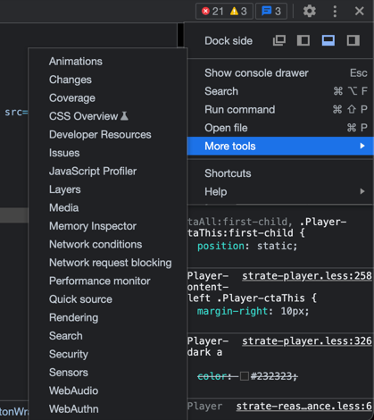

# 1. Digital technologies environmental impacts
Workshop on the impacts of digital technology.
With a focus on environmental impacts for this first part.

The objective at the end of this workshop: as an engineer, to position yourself and master the orders of magnitude of the environmental impacts of digital technology.

The aim is to work by iterations, as in a professional context.

# 📓 Mastering the subject

## INR MOOC
**⏱ 1 hour**

Follow the INR mooc at this address: https://www.academie-nr.org/sensibilisation

Synthesis skills:
- Take notes of what stands out for you (figures, key phrases etc...).
- You can draw, make diagrams, sketch.
- Structure a pitch for the promotion of more responsible digital technology based on your observations.
- No slide: structure your speech on the [start with why] pitch model (https://youtu.be/u4ZoJKF_VuA?t=125).

## Consolidation
**⏱ 15 minutes**

Form groups of 3 people.

- Share your notes and consolidate a pitch.
- Divide the speaking time between you.

The goal: in the company, you will have to speak on the subject, the more time you take to talk about it, the more you will integrate the vocabulary and be at ease.

## Restitution
**⏱ 15 minutes**

3 groups will be selected to convince their class of the interest of pushing a responsible digital approach in business.
The others will be asked to score from 👍1 to 🖐5 their performance on the two criteria:
- Arguments impact (the substance)
- Persuasiveness/conviction (form)

# ⏸ Pause

# 🔥 Architecture for a sustainable digital

You will be conducting a **🔥Xtreme Tech watch** workshop.

This is a **collective intelligence** workshop allowing you to quickly capture information on various tech topics in a very short time.
> More info on the website [speaker deck by Yoan Thirion](https://speakerdeck.com/thirion/xtrem-tech-watch-9997c945-5122-462b-9e18-6913ef56a112?slide=3)

## The topics

### 1. Virtualisation and containerisation of infrastructures
What has been the evolution of server virtualisation technologies and what does containerisation bring?

### 2. Serverless Architecture
What is `serverless` and how does it consume less resources / energy?

### 3. JAMStack Architecture
Did you say `JAMStack`? What is it and what are the advantages from an environmental point of view?

### 4. graphQL API
What is `GraphQL`? And compared to `REST` APIs? How is it better for the planet?

### 5. Micro-services
Why make `Micro-services` instead of an application monolith?

### 6. islands architecture
What is the concept of micro-frontend or `Islands Architecture`?

### 7. Progressive Web Apps
What is `PWA` (Progressive Web Apps)? Why is it more inclusive than a mobile application?

## Make your choice on your own
**⏱ 5 minutes**

Explain your choice and form groups.

## Solo research
**⏱ 15 minutes**

Let's go for a few minutes of research on the topic.

**⚠️ Remember to take notes**

## Combine your research
**⏱ 15 minutes**

Discuss with other participants who have chosen the same topic as you.

Identify the remaining questions and the parts of the topic that still need to be explored.

## Back to exploration
**⏱ 15 minutes**

Explore the remaining questions and grey areas.

Synthesise your findings so that you can present them to the group.

## Restitution
**⏱ 30 minutes**

Each group talks about the topic to the rest of the group.

This is the time to share your **discoveries** but also your **understandings**.

# ⏸ Pause

# 🎯 Measurement
We will test together the measurement tools available on the market.

👋 Form groups of 3 - 4 people.

**Choose a site** (ecommerce, administration, artists ...) **on which you are going to carry out your analyses**.

If you lack inspiration, here is a small list:
- [Fnac.com](https://fnac.com)
- [Laposte.fr](https://laposte.fr)
- [Ameli.fr](https://ameli.fr)
- [CAF.fr](https://www.caf.fr)
- [Impots.gouv.fr](https://www.impots.gouv.fr)
- [Angers.fr](https://www.angers.fr/)
- [Polytech Angers](http://www.polytech-angers.fr)

## Fruggr

**⏱ 30 minutes**

Go to [fruggr.io](https://www.fruggr.io/).

- Add your site to your organisation's services.
- Set the scan to reduce the number of pages scanned to 50.
- Run the scan.

ℹ️ While the scan is finishing, test the following tools (chromium devtools, ecoindex)

👉 Write down the different improvements you would make on the different areas: environment, social, sobriety.

## Chromium Devtools
**20 minutes**

- Open the chromium browser of your choice (chrome, brave, edge ...) and run devtools.
- Go to the `Network` tab and `slow 3G` in the `throttling` menu to simulate loading with a bad 3G connection
- Identify the percentage of unused javascript and css with the `Coverage` tool in `More tools`.

  

- In the `Lighthouse` tab you will find a tool that offers a number of indicators.

Start a `Lighthouse` analysis on the chosen site and **note 3 points to improve**.

## Ecoindex

**20 minutes**

A historical and powerful tool to quickly obtain a score in "ecoscore" format
comparable to those that can be found for household appliances in France.
In addition to this score, the tool quickly provides an action plan to reduce the impact of a given web page.
- Chrome extension](https://chrome.google.com/webstore/detail/greenit-analysis/mofbfhffeklkbebfclfaiifefjflcpad)
- Firefox extension](https://addons.mozilla.org/fr/firefox/addon/greenit-analysis/)

A [web version](https://www.ecoindex.fr/) is also available

The project is supported by the [Collectif Conception Numérique Responsable (cnumr)](https://collectif.greenit.fr/)

👉 Run an analysis on the chosen site and **note 3 points to improve**.
